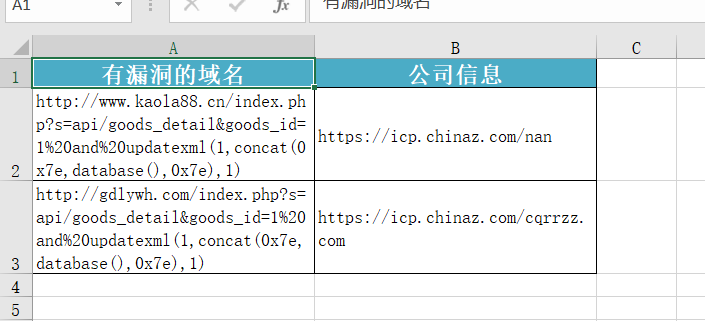

# ip_to_domain介绍

# 工具作用

从fofa上采集符合条件的域名,然后调用市面上公开的poc对域名进行验证，最后输出具有漏洞的域名,**实现自动化刷漏洞**

### 文件结构

```
domain_to_vul.py:主运行程序
fofa.client.py:客户端的配置文件和fofa查询功能的实现
test_sql.py:封装了验证sql注入的脚本
/script/内置的市面上公开的exp的脚本
/result/:fofa语句查询的结果会放到这个文件夹下
/result_vul/:经过exp验证后的具有漏洞的域名会放到这里面
user.ini:用户的配置信息
```

## 工具下载

```
git clone https://github.com/jcxj/ip_to_domain.git
```

## 工具使用

```
python ip_to_domain.py --help
```

```
python ip_to_domain.py -q fofa查询语句 -o 文件名
```

如

```
python ip_to_domain.py -q title="登录 - 商家管理系统" -o a.xlsx
```

### 效果截图


更具体的公司信息，可以去企查查等网站查询




