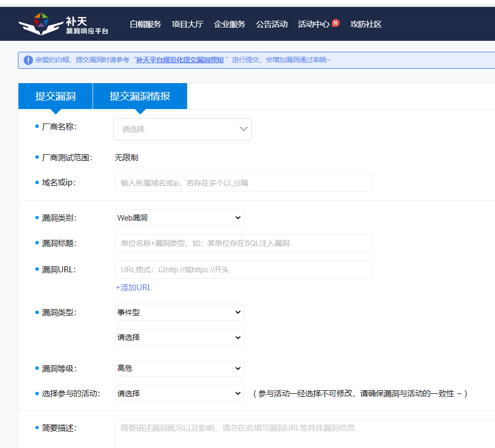

# ip_to_company

# 根据ip找公司

# 背景

### **正常刷漏洞的流程**

1.用fofa进行信息收集，收集结果一般为ip:端口，结果放在 test.txt中

2.用自动化脚本判断网站是否存在漏洞,存在漏洞则记录在 test1.txt;不存在则pass

**3.对test1.txt的内容进行资产确认，判断是哪家公司的资产**

第一个工具，网上很多，就不多讲了

第二个工具，每个漏洞的自动化脚本不一样，也不多说

**第三个工具，也就是我想开发的工具**

# 为什么需要这么一个工具

1.根据ip找厂商没什么技术含量而且浪费时间:无非就是不停的用第三方网站去搜索

2.有这个工具后，这方面浪费的时间就可以节省下来

# 该工具的功能

1.获得厂商名称，所属行业，行业分类，所属地区，厂商联系方式

这几个都是漏洞报告中所需要的

# 工具的思路

1.从test.txt中拿到ip地址

2.调用第三方网站来搜索和ip地址有关的公司

3.利用正则匹配获得该公司的信息，并生成一个excel表

